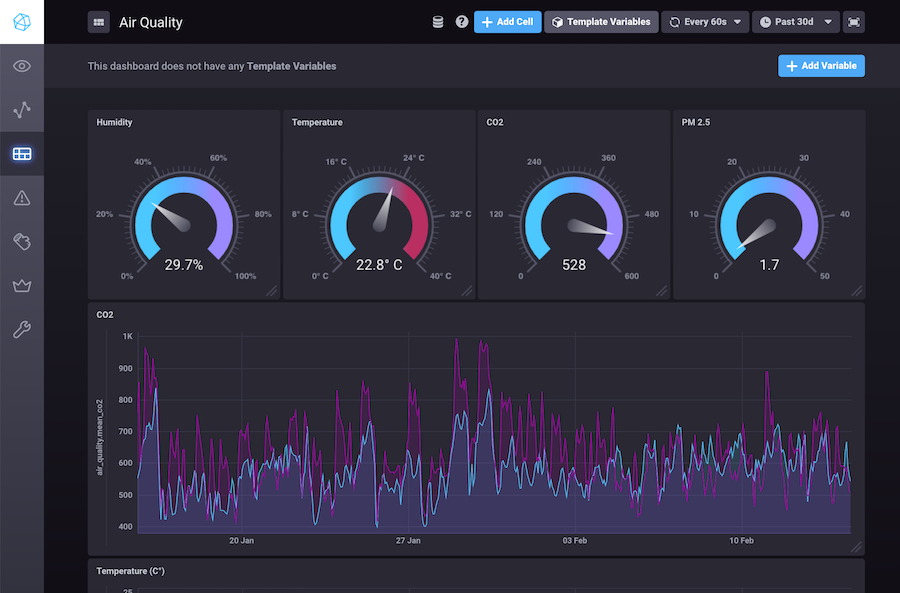

# Awair Sensors to InfluxDB
Simple CLI program that uses the [Awair API](https://developer.getawair.com) to gather readings from your air quality sensors and ingest them into [InfluxDB](https://www.influxdata.com/). This allows you to visualize air quality trends over time 
in a tool like Chronograf.



## Setup

Just clone the repository, copy `config.example.yaml` to `config.yaml` and fill
in the configuration options. You'll need to signup for the [Awair developer program](https://developer.getawair.com) in order to get an API key. You'll want 
to create a new InfluxDB database and add that to the configuration file as well.

You can then install dependencies and run the script -

```
pip3 install -r requirements.txt 
python3 main.py
```

While running it will import samples from all sensors every 15 minutes (using 
the Awair hobbyist plan this is currently the smallest granularity available).

If you need help getting InfluxDB setup, I'd recommend using this [TICK stack 
sandbox](https://github.com/influxdata/sandbox).

